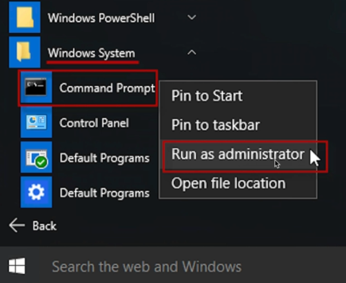

#¡Bienvenido al Webinar de Angular!
___

Lo primero que veremos luego de una pequeña introducción serán las:

##Instalaciones Necesarias

**1.-** La primera instalación necesaria es **NodeJS**
Puedes descargarla e instalarla haciendo click sobre el siguiente [enlace.](https://nodejs.org/es/download/)

Una vez lo hayas instalado, puedes comprobar la versión de tu instalación con los siguientes comandos.

    node -v

Para revisar la versión de nodeJS (debe ser superior a la v.12), pero en este webinar utilizaremos su gestor de paquetes **npm** y para comprobar su versión podemos escribir.

    npm -v

Nos bastará con que sea una versión igual o superior a la v.6

**2.-** La segunda instalación será [Typescript,](https://www.typescriptlang.org/) podemos instalarla ejecutando el siguiente comando en una consola con permisos de **Administrador** de la siguiente manera

    npm install -g typescript

Ahora debemos verificar que tengamos la versión 2.8 en adelante con el siguiente comando

    tsc --version

**3.-** Por último debemos instalar el [Angular Cli](https://cli.angular.io/) ejecutando el siguiente comando con permisos de administrador

    npm install -g @angular/cli

Podrás comprobar su versión con el siguiente comando

    ng --version
___
###Extras

Nó es obligatorio pero se recomienda utilizar el edtitor de texto [VSCode](https://code.visualstudio.com), podrás descargarlo haciendo (click) sobre el siguiente [enlace](https://code.visualstudio.com/download).

#####También se recomienda instalar las siguientes extensiones:

1. Angular 2 TypeScript Emmet
2. Angular Language Service
3. Bracket Pair Colorizer
4. file-icons
5. Polacode
6. Prettier - Code formatter
7. Auto Import