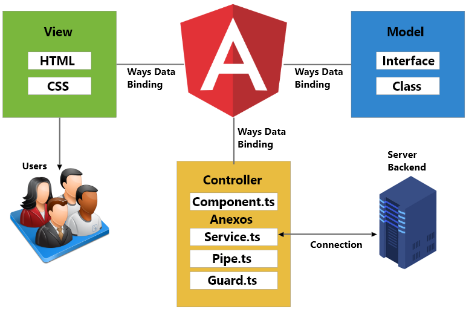
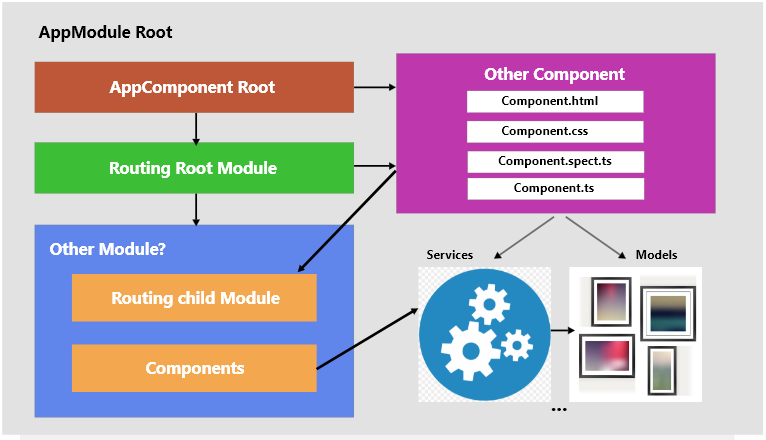

## Bienvenido a tu primer proyecto con Angular
___
### Estructura MVC



### Arquitectura y funcionamiento


___

Una véz hayan quedado claros los conceptos ejecutamos el siguiente comanco en una terminal ubicada dentro del proyecto

    ng g p pipes/filter

Lo que hará es generar un pipe de la carpeta pipes, que utilizaremos para hacer búsquedas
___

Lo que sigue ahora es instalar [Angular_Material](https://material.angular.io/) utilizando el siguiente comando

    ng add @angular/material

Una vez se haya instalado, crearemos un archivo llamado **material.ts**
dentro de la carpeta **app** y dentro de este archivo typearemos el siguiente código

```ts
import { NgModule } from '@angular/core';
import { CommonModule } from '@angular/common';

const myModule = [];

@NgModule({
  declarations: [],
  imports: [CommonModule, myModule],
  exports: [ myModule ]
})
export class MaterialModule { }
```
**Ahora sí estamos listos para trabajar, ¡manos a la obra!**
